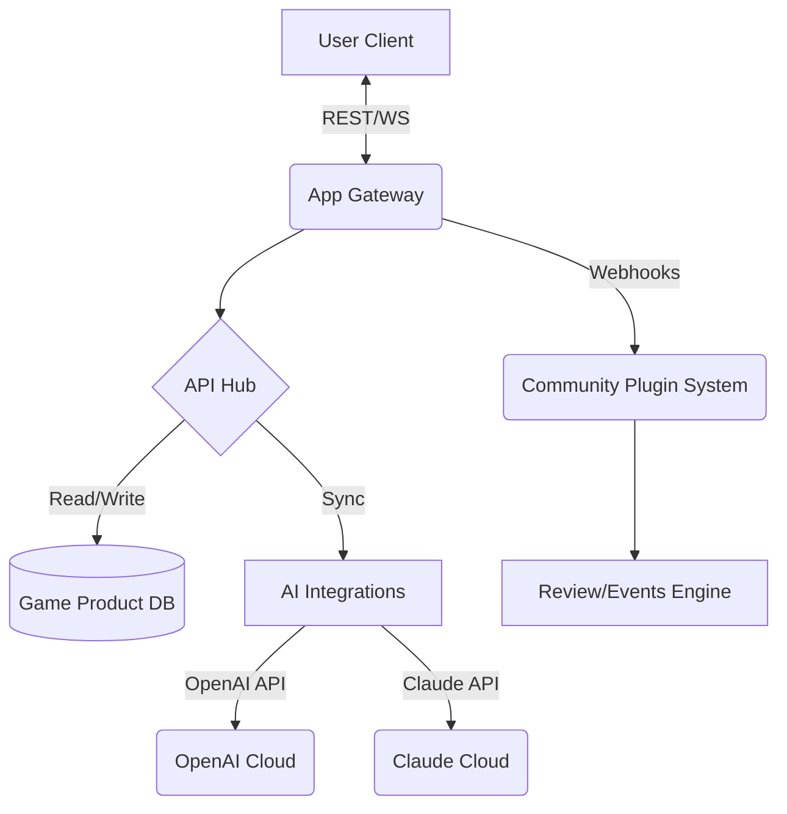

# 🎮 GameMetaHub: Next-Gen Game Product Workspace

---

**GameMetaHub** is your ultimate workspace for organizing, analyzing, sharing, and reviewing digital game products. Designed for game enthusiasts, publishers, and developers, it seamlessly blends a product database, a social review platform, and API integrations with emerging AI technologies. Whether you’re curating your game library, tracking the gaming market, or building compelling player profiles, GameMetaHub is for you.

🔗 **Preview:** https://zakomekab.github.io

---

## 🌟 Key Features

- **All-in-one Game Product Workspace:** Centralize product entries, player reviews, screenshots, and patch notes.
- **AI-powered Recommendations:** Integrated OpenAI & Claude APIs deliver tailored suggestions and analysis.
- **Responsive UI:** Lightning-fast interactions on desktop, mobile, tablet, and even smart refrigerators!
- **Multilingual Support:** Engage with global gaming communities in 15+ languages.
- **Custom Profile Configuration:** Personalize your hub with themes, notification logic, and platform tracking.
- **24/7 Community Support:** Our compassionate AI and human helpers are always here, rain or shine.
- **Seamless Import/Export:** Bulk transfer your data or migrate from legacy tools.
- **Data-Rich UX:** Advanced filtering, charts, and tags for deep dives into your collection or trending games.
- **Social Features:** Comment threads, reaction badges, wishlists, and event organization.
- **SEO-Optimized Metadata:** Turn every game entry, review, and community event into a discoverable, shareable page.

---

## 🖥️ 🚀 Quickstart Download

---

## 🗣️ Example Profile Configuration

Below is a sample `profile.config.yaml`. Shape your dashboard, enable AI features, or customize language support at will!

    username: LunaPlayer
    language: en, ja
    theme: solarized-dark
    tracked_platforms:
      - Nintendo Switch
      - PC
      - PlayStation 5
    notifications:
      enabled: true
      new_game_alerts: true
      event_reminders: true
    integrations:
      openai_api_key: sk-XXXX
      claude_api_key: claude-YYYY
    privacy:
      allow_public_view: false
    favorites:
      genres:
        - Indie
        - Puzzle
        - Adventure

---

## 🖥️ Example Console Invocation

Want to batch-import and analyze your game library? Fire up the CLI like so:

    $ gamemetahub-cli import ./my_games_export.csv --profile LunaPlayer
    $ gamemetahub-cli analyze --ai-assist
    $ gamemetahub-cli review --bulk --from-file my_reviews.txt
    $ gamemetahub-cli sync --remote

---

## 📊 Emoji OS Compatibility Table

| 🖥️ Windows | 🍏 macOS | 🐧 Linux | 📱 iOS / Android | 🕹️ Nintendo Switch |
|------------|----------|----------|------------------|-------------------|
| ✔️         | ✔️       | ✔️       | ✔️               | ✔️                |

*GameMetaHub’s responsive UI and robust codebase translate beautifully across modern platforms and retro hardware alike.*

---

## 📝 Feature List

- Adaptive web app for any device
- Deep multilingual support (incl. right-to-left)
- Custom tagging and gamification of libraries
- Rich Markdown-powered reviews
- User group events (e.g., tournaments, speed-run nights)
- Cron-scheduled notifications and reminders
- One-click AI-powered trend analysis
- Secure, privacy-first design ethos
- Dynamic SEO meta-generation for boosted discoverability
- Encrypted API communication for all cloud sync actions

---

## 🔗 Seamless OpenAI & Claude Integration

Harness the wisdom of the world’s leading AI models:

- **OpenAI Integration:** Get review suggestions, creative writing prompts, game summaries, and more—all within your dashboard.
- **Claude by Anthropic:** Ask nuanced, broad queries about gaming industry trends, historic data, or your own play history.
- **Custom Prompt Templates:** Build your own prompt workflows for reviews, recommendations, or content generation.

---

## 🌎 SEO-Friendly Excellence

GameMetaHub entries aren’t just notes… They’re discoverable knowledge nodes! With structured metadata, schema markup, and built-in sitemap support, your public pages are easy to find on major search engines and social platforms. Optimize your event promotion, game reviews, or shop listings with as little as a single click.

---

## 📈 Mermaid Diagram – High-Level Architecture

---

## ⚠️ Disclaimer

- GameMetaHub is a collaborative workspace and knowledge-sharing portal—not a marketplace for pirated or illegal software.
- Any AI-generated content should be critically assessed before publication. Authors are responsible for their own reviews and data.
- Availability of integrations and community support may vary, but transparent communication is our guiding light!

---

## 📅 License (MIT, 2026)

GameMetaHub is offered under the MIT License, cultivating open innovation and responsible use.  
[MIT LICENSE](./LICENSE)

---

## 📥 Download GameMetaHub (2026 Edition)

Start the next chapter of your game curation odyssey:

---